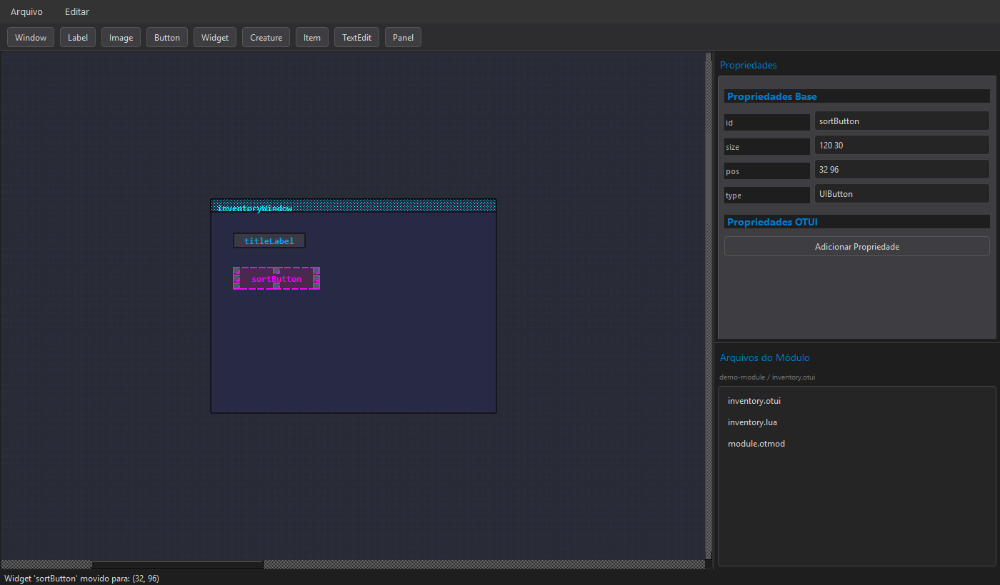

<div align="center">

# OTUI Editor

**A visual workspace for building and maintaining OTUI/OTMD interfaces used by OTClient projects.**

[](https://www.python.org/)
[](https://doc.qt.io/qtforpython-6/)
[](https://github.com/lehnox/Otui-Editor---Tibia/stargazers)
[](https://github.com/lehnox/Otui-Editor---Tibia/forks)

</div>



## Why this editor exists

OTUI is expressive, but maintaining a large interface directly in text can make positioning, hierarchy, image paths, anchors, and layout behavior difficult to reason about. OTUI Editor turns those files into an interactive scene while keeping the original format at the center of the workflow.

The project is designed for developers and content creators working with **OpenTibia**, **OTClient**, custom clients, and related modding environments. It can index an existing module, resolve its resources, render its widgets, expose their properties, and write the edited hierarchy back to OTUI.

## What you can do

### Edit interfaces visually

- Move and resize widgets directly on a grid-based canvas.
- Pan and zoom through larger interface layouts.
- Use eight resize handles and configurable grid snapping.
- Duplicate, remove, reorder, and organize selected widgets.
- Work with common widget types including windows, labels, images, buttons, items, creatures, text edits, panels, and generic widgets.

### Work with real OTClient modules

- Load a module directory rather than an isolated file.
- Read `.otmod` metadata and discover image directories.
- Index `.otui`, `.otmd`, and `.lua` files automatically.
- Resolve relative image and icon paths against project resources.
- Restore the last edited file and canvas state for a module.

### Control layout and appearance

- Edit standard and custom properties from a live property panel.
- Pick image resources through a thumbnail browser.
- Select colors with the native Qt color dialog.
- Configure boolean values without manually editing text.
- Render image tinting, clipping, offsets, sizing, and nine-slice borders.
- Preserve parent-child hierarchy, anchors, and vertical or horizontal layouts.

### Keep changes reversible

- Record canvas changes in an undo/redo history.
- Serialize the complete scene state.
- Export an indented OTUI hierarchy with normalized resource paths.
- Copy external image resources into the module when required.

## Quick start

### Requirements

- Python 3.10 or newer
- PySide6
- An OTClient module or OTUI/OTMD file to edit

### Install

```bash
git clone https://github.com/lehnox/Otui-Editor---Tibia.git
cd Otui-Editor---Tibia

python -m venv .venv
```

Activate the virtual environment:

```bash
# Windows
.venv\Scripts\activate

# Linux or macOS
source .venv/bin/activate
```

Install the GUI dependency and start the editor:

```bash
python -m pip install PySide6
python Otui.py
```

## First workflow

1. Open **File > Open Project** and select an OTClient module directory.
2. Choose an indexed `.otui` or `.otmd` file from the module browser.
3. Add or select widgets on the canvas.
4. Adjust geometry, resources, colors, layouts, and custom properties.
5. Save the document and verify it in the target OTClient build.

The editor writes the source format directly. Keep project files under version control so changes can be reviewed and reverted alongside the rest of the client.

## Keyboard shortcuts

| Action | Shortcut |
| --- | --- |
| New project | `Ctrl+Shift+N` |
| Open project | `Ctrl+O` |
| Create OTUI file | `Ctrl+N` |
| Open OTUI file | `Ctrl+Shift+O` |
| Save current file | `Ctrl+S` |
| Undo | `Ctrl+Z` |
| Redo | `Ctrl+Y` |
| Duplicate selection | `Ctrl+D` |
| Delete selection | `Delete` |

## Architecture

The application currently lives in a single executable module, with responsibilities separated into focused classes:

| Component | Responsibility |
| --- | --- |
| `OTUIEditor` | Main window, menus, workspace state, and project lifecycle |
| `ModuleProject` | Module metadata, file indexing, image roots, and saved state |
| `Canvas` | Scene navigation, selection, history, and widget creation |
| `WidgetItem` | Geometry, hierarchy, property application, and rendering |
| `PropertiesEditor` | Live property controls and type-specific editors |
| `ImageSourceBrowser` | Resource navigation and thumbnail selection |
| `OTUIParser` | Indentation-aware parsing into the visual hierarchy |
| `save_otui` | Ordered serialization back to the OTUI format |

```text
OTClient module
      |
      v
ModuleProject --> OTUIParser --> Canvas / WidgetItem tree
      |                                  |
      +--> ResourceResolver              v
                                  PropertiesEditor
                                           |
                                           v
                                       save_otui
```

## Current scope

The editor covers the core authoring loop and a broad set of OTUI properties. OTClient distributions can introduce custom widgets or behaviors, so exported files should always be tested with the specific client they target.

Areas planned for continued improvement include:

- richer visual editing for widget states and events;
- validation for hierarchy, anchors, and project resources;
- previews for hover, pressed, focused, and disabled states;
- reusable snippets and property completion;
- theme and plugin support;
- additional automated tests around parsing and serialization.

## Contributing

Bug reports, compatibility notes, focused fixes, and improvements to format support are welcome. When reporting a parsing or rendering problem, include a minimal OTUI example, the expected result, the observed result, and the OTClient distribution you are using.

Please avoid sharing private server assets or credentials in issues, screenshots, or sample projects.

## Project note

OTUI Editor is a community tool and is not an official OTClient or Tibia product. OTClient and OpenTibia names belong to their respective projects and communities.
